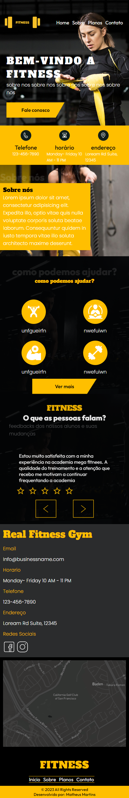
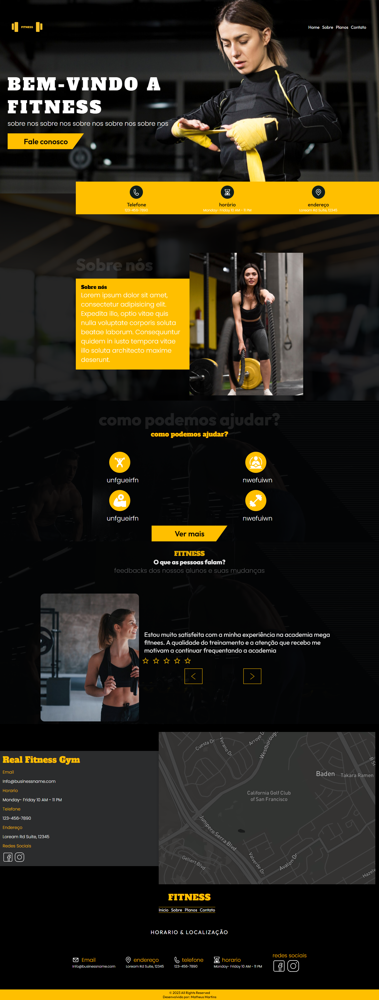

# Projeto de Landing Page de Academia 💪

Este projeto de landing page foi desenvolvido como parte do meu processo de prática e aprimoramento de habilidades em HTML e CSS. Inspirado no conceito "mobile first", o design foi cuidadosamente elaborado para garantir uma experiência de usuário intuitiva e eficaz em dispositivos móveis.

## Responsividade com Media Queries 📱💻

Utilizando media queries, a landing page foi tornada responsiva, proporcionando uma navegação fluida e agradável em tablets, notebooks e desktops. A adaptação do layout para diferentes tamanhos de tela assegura que o conteúdo seja apresentado de maneira otimizada em todas as plataformas.

## Animações Atraentes com AOS - Animate on Scroll 🚀

Para incrementar a experiência visual, integrei a biblioteca AOS (Animate on Scroll), incorporando animações sutis e atraentes que são acionadas conforme o usuário rola a página. Essas animações proporcionam um toque dinâmico ao conteúdo, tornando a interação mais envolvente.

## Demonstração Visual 📸🎥

### Mobile

### Desktop

### Vídeo de Demonstração
[Link para o Vídeo](link_para_video)

## Como Utilizar 🚀

1. Abra o arquivo [index.html](https://mattheus910.github.io/academia/) no seu navegador preferido.

## Contribuições 🤝

Contribuições são bem-vindas! Sinta-se à vontade para abrir issues ou enviar pull requests para melhorar este projeto.

## Licença 📝

Este projeto é licenciado sob a Licença MIT.

Espero que este projeto seja útil e inspire outros desenvolvedores a explorar e aprimorar suas habilidades front-end. Divirta-se explorando e personalizando esta landing page para atender às suas necessidades específicas!
